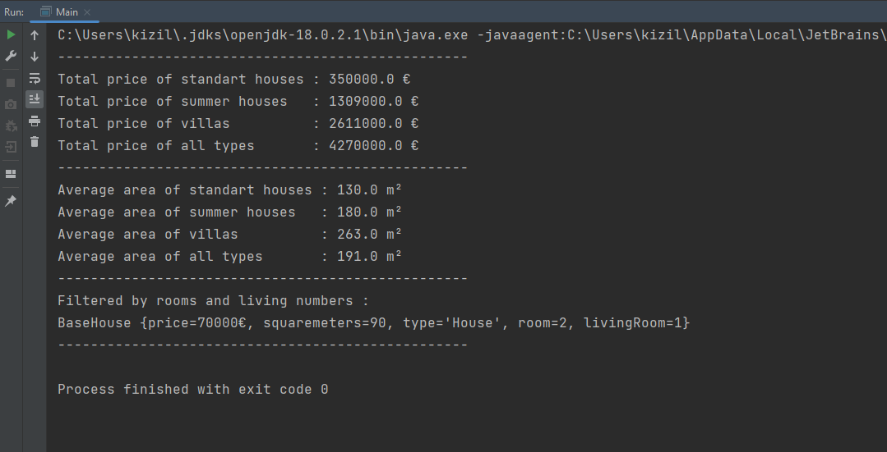

# DefineX Java Spring Practicum First Task
## Requirements
- Create 3 House Types -> House, Villa, Summer House
- Create a class includes three instance of each house types and  "getHouseList", "getVillaList" and "getSummerhouseList" functions.
- Create a service includes given methods:
  - A method returns total price of the houses.
  - A method returns total price of the villas.
  - A method returns total price of the summer houses.
  - A method returns total price of the all types of houses(house, villa, summer house).
  - A method return average area of the houses.
  - A method return average area of the villas.
  - A method return average area of the summer houses.
  - A method return average area of the all types of houses(house, villa, summer house).
  
### Note:
- Function and variable names have to be in English.
- Design in accordance with object-oriented programming.
- Follow clean code principles.
- Print all of the results in the main function in a readable way.

### Output:

